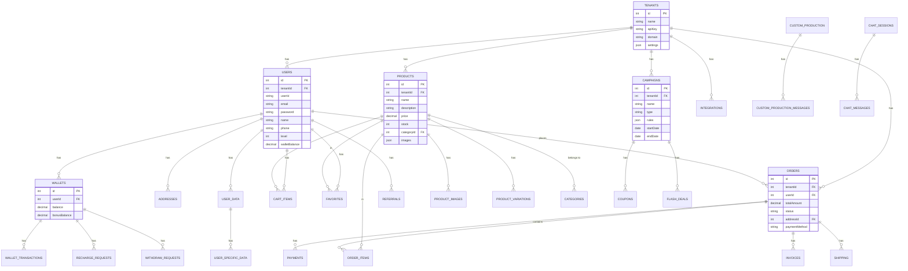

```mermaid3. Admin Paneli Özellikleri


```mermaid4. Backend API Mimarisi

```mermaid
graph LR
    subgraph "API Routes"
        AUTH[/api/auth<br/>Kimlik Doğrulama]
        USERS[/api/users<br/>Kullanıcı Yönetimi]
        PRODUCTS[/api/products<br/>Ürün Yönetimi]
        CART[/api/cart<br/>Sepet İşlemleri]
        ORDERS[/api/orders<br/>Sipariş Yönetimi]
        PAYMENT[/api/payment<br/>Ödeme İşlemleri]
        WALLET[/api/wallet<br/>Cüzdan İşlemleri]
        CAMPAIGNS[/api/campaigns<br/>Kampanya Yönetimi]
        ANALYTICS[/api/analytics<br/>Analitik]
        ML_ROUTES[/api/ml<br/>ML Servisleri]
        RECOMMENDATIONS[/api/recommendations<br/>Öneriler]
        SEGMENTS[/api/segments<br/>Segmentasyon]
        STORIES[/api/stories<br/>Hikayeler]
        SLIDERS[/api/sliders<br/>Sliderlar]
        POPUPS[/api/popups<br/>Popuplar]
        FLASH_DEALS[/api/flash-deals<br/>Flash İndirimler]
        LIVE_USERS[/api/live-users<br/>Canlı Kullanıcılar]
        BACKUP[/api/backup<br/>Yedekleme]
        SCRAPERS[/api/scrapers<br/>Web Scraping]
        DEALERSHIP[/api/dealership<br/>Bayilik]
        CHAT[/api/chat<br/>Sohbet]
    end
    
    subgraph "Services"
        AUTH_SVC[Authentication Service]
        USER_SVC[User Service]
        PRODUCT_SVC[Product Service]
        ORDER_SVC[Order Service]
        PAYMENT_SVC[Payment Service<br/>İyzico]
        WALLET_SVC[Wallet Service]
        ANALYTICS_SVC[Analytics Service]
        ML_SVC[ML Service Client]
        RECOMMENDATION_SVC[Recommendation Service]
        SEGMENT_SVC[Segment Service]
        XML_SVC[XML Sync Service]
        GMAPS_SVC[Google Maps Service]
        TRENDYOL_SVC[Trendyol API]
        HEPSIBURADA_SVC[Hepsiburada API]
        ENCRYPTION_SVC[Encryption Service]
        QUEUE_SVC[Queue Service<br/>BullMQ]
    end
    
    subgraph "Middleware"
        TENANT[Tenant Isolation]
        API_KEY[API Key Auth]
        JWT_AUTH[JWT Auth]
        RATE_LIMIT[Rate Limiting]
        CORS[CORS]
        HELMET[Helmet Security]
        COMPRESSION[Compression]
    end
    
    AUTH --> AUTH_SVC
    USERS --> USER_SVC
    PRODUCTS --> PRODUCT_SVC
    CART --> PRODUCT_SVC
    ORDERS --> ORDER_SVC
    PAYMENT --> PAYMENT_SVC
    WALLET --> WALLET_SVC
    CAMPAIGNS --> USER_SVC
    ANALYTICS --> ANALYTICS_SVC
    ML_ROUTES --> ML_SVC
    RECOMMENDATIONS --> RECOMMENDATION_SVC
    SEGMENTS --> SEGMENT_SVC
    
    TENANT --> API_KEY
    API_KEY --> JWT_AUTH
    JWT_AUTH --> RATE_LIMIT
    RATE_LIMIT --> CORS
    CORS --> HELMET
    HELMET --> COMPRESSION
```


```mermaid5. Veritabanı Şeması




```mermaid6. ML Servisi Mimarisi


```mermaid7. Ödeme Akışı


```mermaid8. Multi-Tenant Yapısı


```mermaid9. Güvenlik Katmanları


```mermaid10. Entegrasyonlar ve Dış Servisler


```mermaid11. Deployment Mimarisi


```mermaid12. Teknoloji Stack Detayları


```mermaid13. API Endpoint Yapısı

```mermaid
graph TB
    subgraph "Public Endpoints"
        HEALTH[/api/health<br/>GET]
        LOGIN[/api/users/login<br/>POST]
        REGISTER[/api/users<br/>POST]
        PRODUCTS_PUBLIC[/api/products<br/>GET]
    end
    
    subgraph "Authenticated Endpoints"
        PROFILE[/api/users/profile<br/>GET/PUT]
        CART[/api/cart<br/>GET/POST/PUT/DELETE]
        ORDERS[/api/orders<br/>GET/POST]
        PAYMENT[/api/payment<br/>POST]
        WALLET[/api/wallet<br/>GET/POST]
        ADDRESSES[/api/addresses<br/>GET/POST/PUT/DELETE]
    end
    
    subgraph "Admin Endpoints"
        ADMIN_DASHBOARD[/api/admin/dashboard<br/>GET]
        ADMIN_PRODUCTS[/api/admin/products<br/>CRUD]
        ADMIN_ORDERS[/api/admin/orders<br/>CRUD]
        ADMIN_USERS[/api/admin/users<br/>CRUD]
        ADMIN_CAMPAIGNS[/api/admin/campaigns<br/>CRUD]
        ADMIN_ANALYTICS[/api/admin/analytics<br/>GET]
        ADMIN_ML[/api/admin/ml<br/>GET/POST]
        ADMIN_RECOMMENDATIONS[/api/admin/recommendations<br/>GET]
        ADMIN_SEGMENTS[/api/admin/segments<br/>GET]
        ADMIN_STORIES[/api/admin/stories<br/>CRUD]
        ADMIN_SLIDERS[/api/admin/sliders<br/>CRUD]
        ADMIN_POPUPS[/api/admin/popups<br/>CRUD]
        ADMIN_FLASH_DEALS[/api/admin/flash-deals<br/>CRUD]
        ADMIN_LIVE_USERS[/api/admin/live-users<br/>GET]
        ADMIN_BACKUP[/api/admin/backup<br/>GET/POST]
        ADMIN_SCRAPERS[/api/admin/scrapers<br/>POST]
    end
    
    subgraph "ML Endpoints"
        ML_HEALTH[/api/ml/health<br/>GET]
        ML_STATS[/api/ml/stats<br/>GET]
        ML_MODELS[/api/ml/models<br/>GET/POST]
        ML_PREDICT[/api/ml/predict<br/>POST]
        ML_RECOMMEND[/api/ml/recommend<br/>POST]
    end
```


```mermaid14. Veri Akışı - Kullanıcı Etkileşimi


```mermaid15. Kampanya ve İndirim Sistemi


```mermaid16. Öneri Sistemi Mimarisi


```mermaid17. Canlı Kullanıcı Takibi


```mermaid18. XML Ürün Senkronizasyonu


```mermaid19. Chatbot Sistemi


```mermaid20. Cüzdan Sistemi İşlemleri


```mermaid21. Güvenlik ve Yetkilendirme Akışı

```mermaid
sequenceDiagram
    participant C as Client
    participant NGINX as Nginx
    participant API as Backend API
    participant AUTH as Auth Service
    participant DB as MySQL
    participant REDIS as Redis
    
    C->>NGINX: HTTPS Request
    NGINX->>NGINX: SSL Termination
    NGINX->>API: Forward Request
    
    API->>API: Helmet Security Headers
    API->>API: CORS Check
    API->>API: Rate Limiting Check
    
    alt Public Endpoint
        API-->>C: Public Response
    else Protected Endpoint
        API->>API: API Key Check (X-API-Key)
        alt Invalid API Key
            API-->>C: 401 Unauthorized
        else Valid API Key
            API->>AUTH: Tenant Resolution
            AUTH->>DB: Tenant Lookup
            DB-->>AUTH: Tenant Data
            AUTH-->>API: Tenant Context
            
            alt Admin Endpoint
                API->>API: JWT Token Check
                alt Invalid Token
                    API-->>C: 401 Unauthorized
                else Valid Token
                    API->>AUTH: Role Check
                    AUTH->>DB: Permission Lookup
                    DB-->>AUTH: Permissions
                    alt Insufficient Permissions
                        AUTH-->>API: 403 Forbidden
                        API-->>C: 403 Forbidden
                    else Sufficient Permissions
                        AUTH-->>API: Authorized
                        API->>DB: Business Logic
                        DB-->>API: Data
                        API-->>C: Success Response
                    end
                end
            else User Endpoint
                API->>AUTH: User Authentication
                AUTH->>REDIS: Session Check
                alt Valid Session
                    REDIS-->>AUTH: Session Data
                    AUTH-->>API: Authenticated
                    API->>DB: Business Logic
                    DB-->>API: Data
                    API-->>C: Success Response
                else Invalid Session
                    REDIS-->>AUTH: No Session
                    AUTH-->>API: Unauthenticated
                    API-->>C: 401 Unauthorized
                end
            end
        end
    end
```


```mermaid22. Performans Optimizasyonları

```mermaid
graph TB
    subgraph "Caching Strategy"
        REDIS_CACHE[Redis Cache<br/>Hot Data]
        MEMORY_CACHE[In-Memory Cache<br/>Frequently Accessed]
        CDN[CDN<br/>Static Assets]
    end
    
    subgraph "Database Optimization"
        CONNECTION_POOL[Connection Pooling<br/>20 Connections]
        READ_REPLICA[Read Replicas<br/>Load Distribution]
        INDEXING[Database Indexing<br/>Query Optimization]
        QUERY_CACHE[Query Cache<br/>Frequent Queries]
    end
    
    subgraph "Application Optimization"
        COMPRESSION[Response Compression<br/>Gzip/Brotli]
        LAZY_LOADING[Lazy Loading<br/>On-Demand Loading]
        CODE_SPLITTING[Code Splitting<br/>Bundle Optimization]
        PARALLEL_REQUESTS[Parallel Requests<br/>Concurrent Processing]
    end
    
    subgraph "Monitoring"
        PERFORMANCE_MON[Performance Monitoring<br/>Response Times]
        ERROR_TRACKING[Error Tracking<br/>Exception Handling]
        RESOURCE_USAGE[Resource Usage<br/>CPU/Memory]
    end
    
    REDIS_CACHE --> CONNECTION_POOL
    MEMORY_CACHE --> READ_REPLICA
    CDN --> INDEXING
    COMPRESSION --> QUERY_CACHE
    LAZY_LOADING --> PARALLEL_REQUESTS
    CODE_SPLITTING --> PERFORMANCE_MON
    PARALLEL_REQUESTS --> ERROR_TRACKING
    PERFORMANCE_MON --> RESOURCE_USAGE
```


```mermaid23. Loglama ve İzleme Sistemi

```mermaid
graph TB
    subgraph "Log Sources"
        API_LOGS[API Logs<br/>Request/Response]
        ERROR_LOGS[Error Logs<br/>Exceptions]
        ACCESS_LOGS[Access Logs<br/>Nginx]
        BUSINESS_LOGS[Business Logs<br/>Transactions]
        ML_LOGS[ML Service Logs<br/>Predictions]
    end
    
    subgraph "Log Processing"
        MORGAN[Morgan<br/>HTTP Logging]
        WINSTON[Winston<br/>Structured Logging]
        FILE_LOG[File Logging<br/>Rotating Logs]
    end
    
    subgraph "Log Storage"
        LOG_FILES[Log Files<br/>/logs Directory]
        DB_LOGS[(Database Logs<br/>Admin Logs Table)]
    end
    
    subgraph "Monitoring"
        PM2_MON[PM2 Monitoring<br/>Process Health]
        HEALTH_CHECK[Health Checks<br/>Service Status]
        ALERTS[Alerting System<br/>Critical Events]
    end
    
    API_LOGS --> MORGAN
    ERROR_LOGS --> WINSTON
    ACCESS_LOGS --> FILE_LOG
    BUSINESS_LOGS --> WINSTON
    ML_LOGS --> WINSTON
    
    MORGAN --> LOG_FILES
    WINSTON --> LOG_FILES
    FILE_LOG --> LOG_FILES
    WINSTON --> DB_LOGS
    
    LOG_FILES --> PM2_MON
    DB_LOGS --> HEALTH_CHECK
    PM2_MON --> ALERTS
    HEALTH_CHECK --> ALERTS
```


```mermaid24. Backup ve Yedekleme Stratejisi

```mermaid
graph TB
    subgraph "Backup Types"
        DB_BACKUP[Database Backup<br/>MySQL Dump]
        FILE_BACKUP[File Backup<br/>Uploads/Images]
        CONFIG_BACKUP[Config Backup<br/>Settings]
    end
    
    subgraph "Backup Schedule"
        DAILY[Daily Backup<br/>Full Database]
        WEEKLY[Weekly Backup<br/>Incremental]
        MONTHLY[Monthly Backup<br/>Archive]
    end
    
    subgraph "Backup Storage"
        LOCAL[Local Storage<br/>Server]
        REMOTE[Remote Storage<br/>Cloud/FTP]
        COMPRESSED[Compressed Archives<br/>Zip/Tar]
    end
    
    subgraph "Recovery"
        RESTORE[Restore Process<br/>Data Recovery]
        VERIFY[Verification<br/>Backup Integrity]
    end
    
    DB_BACKUP --> DAILY
    FILE_BACKUP --> WEEKLY
    CONFIG_BACKUP --> MONTHLY
    
    DAILY --> LOCAL
    WEEKLY --> REMOTE
    MONTHLY --> COMPRESSED
    
    LOCAL --> RESTORE
    REMOTE --> RESTORE
    COMPRESSED --> RESTORE
    RESTORE --> VERIFY
```


```mermaid25. Özellik Matrisi - Tüm Modüller

```mermaid
graph TB
    subgraph "Core Features"
        AUTH_FEAT[Authentication<br/>Login/Register/2FA]
        USER_FEAT[User Management<br/>Profile/Settings]
        PRODUCT_FEAT[Product Management<br/>Catalog/Search/Filter]
        CART_FEAT[Cart Management<br/>Add/Update/Remove]
        ORDER_FEAT[Order Management<br/>Create/Track/Cancel]
    end
    
    subgraph "Payment Features"
        PAYMENT_FEAT[Payment Processing<br/>Card/EFT/Wallet]
        WALLET_FEAT[Wallet System<br/>Balance/Transfer]
        INVOICE_FEAT[Invoice Generation<br/>PDF/Email]
    end
    
    subgraph "Marketing Features"
        CAMPAIGN_FEAT[Campaign Management<br/>Flash/Coupon/Wheel]
        NOTIFICATION_FEAT[Notifications<br/>Push/Email/SMS]
        STORY_FEAT[Stories<br/>Instagram-like]
        SLIDER_FEAT[Sliders<br/>Banner Management]
        POPUP_FEAT[Popups<br/>Announcements]
    end
    
    subgraph "Analytics Features"
        ANALYTICS_FEAT[Analytics<br/>Sales/User/Product]
        ML_FEAT[ML Insights<br/>Predictions/Recommendations]
        SEGMENT_FEAT[Segmentation<br/>User Groups]
        LIVE_FEAT[Live Users<br/>Real-time Tracking]
    end
    
    subgraph "Advanced Features"
        CUSTOM_PROD[Custom Production<br/>Made-to-Order]
        DEALERSHIP[Dealership<br/>Franchise System]
        REFERRAL[Referral System<br/>Rewards]
        CHATBOT[Chatbot<br/>AI Support]
        NFC[NFC Scanning<br/>Product Identification]
    end
    
    AUTH_FEAT --> USER_FEAT
    USER_FEAT --> PRODUCT_FEAT
    PRODUCT_FEAT --> CART_FEAT
    CART_FEAT --> ORDER_FEAT
    ORDER_FEAT --> PAYMENT_FEAT
    PAYMENT_FEAT --> WALLET_FEAT
    WALLET_FEAT --> INVOICE_FEAT
    CAMPAIGN_FEAT --> NOTIFICATION_FEAT
    NOTIFICATION_FEAT --> STORY_FEAT
    STORY_FEAT --> SLIDER_FEAT
    SLIDER_FEAT --> POPUP_FEAT
    ANALYTICS_FEAT --> ML_FEAT
    ML_FEAT --> SEGMENT_FEAT
    SEGMENT_FEAT --> LIVE_FEAT
    CUSTOM_PROD --> DEALERSHIP
    DEALERSHIP --> REFERRAL
    REFERRAL --> CHATBOT
    CHATBOT --> NFC
```
